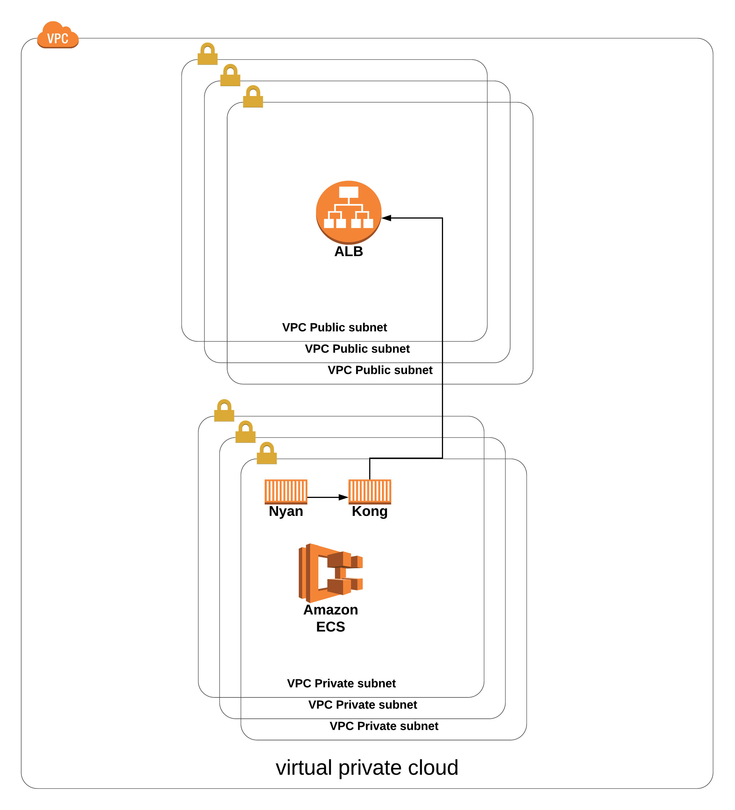

# Overview

Deploy [Kong](https://konghq.com/kong-community-edition/) to AWS, with RDS (Postgres), in highly-available multi-AZ and secure config

Note: Service Discovery currently uses [ECS Service Discovery](https://docs.aws.amazon.com/AmazonECS/latest/developerguide/service-discovery.html)

# References:
1. [Nick Doyle's Post on Medium](https://medium.com/@nick.p.doyle/deploying-kong-to-aws-elastic-container-service-with-terraform-9de83d7e21)
2. [Nick Doyle's Repo on Bitbucket](https://bitbucket.org/nick_doyle/kong_aws_terraform/src/master/)
3. [Terraform AWS Modules](https://github.com/terraform-aws-modules)

# Instructions

1. Clone this repo
2. [Install terraform](https://www.terraform.io/intro/getting-started/install.html) (alternatively - [run terraform via docker](https://hub.docker.com/r/hashicorp/terraform/) - note they don't mention there to mount the directory with TF templates to the container, don't forget that)
3. Update variables.tf according to your environment
4. `terraform init`
5. `terraform apply`

# Functionality

## ECS Services

- Kong Gateway
    - port 8000 (standard API Gateway) open from ALB and Bastion (kong.ecs.local)
    - port 8001 (admin API) open from Kong Dashboard container
- Kong Dashboard
    - connects to kong ADMIN API port 8001
    - port 8080 (standard HTTP interface) open from Bastion (kong-dash.ecs.local)
- Nyan
    - shows nyan cat
    - port 80 open from Kong Gateway (nyan.ecs.local)

## Bastion Host

Admin interfaces should arguably only ever be available over VPN or via bastion. To this end a basic bastion is provided, see bastion.tf.

bastion host is not (currently) HA, sits in public subnet 1.

To access kong admin api:

`ssh -N -L 8001:8001 ubuntu@52.64.239.9`

(where '52.64.239.9' is IP of the bastion host)

Then connect to localhost:8001

## Kong Docker Image

### Configured from SSM Parameters

The standard [Kong docker image](https://hub.docker.com/_/kong/) takes configuration from environment variables. Deploying this would tie Kong's configuration to the task definition which has two main disadvantages:

- Configuration updates require deploying new task definition
- Secrets must be stored in task definition
- No canonical secret/config store

For these reasons it was decided to extend the standard Kong 0.14.0-alpine image to optionally take its config from SSM parameters.

This was done by installing awscli, jq and curl in the image, and modifying docker-entrypoint.sh to use these to (if provided) obtain the config and override Kong's default environment variables.

The SSM parameter names are passed in as environment variables at 'docker run' time i.e. container definition (see main.tf resource "aws_ecs_task_definition"). By default these are all SecureStrings nested under prefix "/dev/kong/"

The parameters are set at terraform apply-time - see main.tf e.g. resource "aws_ssm_parameter" "db_username"

My [docker image with Kong taking configuration from SSM parameter store is on DockerHub](https://hub.docker.com/r/rdkls/kong_ssm)

### Permissions

This setup also requires that the running container (task) have permission to read and decrypt the SSM Parameters.

This is done using AWS' "task_role" concept, which assigns an IAM role to the task by passing in environment variable "AWS_CONTAINER_CREDENTIALS_RELATIVE_URI", which is used to obtain assumed role for the container.

Such approach means the container instance itself, nor any other container tasks running on same instance, can access these secrets.

This IAM work took quite some time to debug; had to modify entrypoint/command in deployed task definition, to just e.g. "/usr/bin/env", or "/usr/bin/aws ssm get-parameter ..", then ssh to the docker host/container instance and view logs (or via cloudwatch, but that's slower)

The IAM role is created by custom module in modules/ecs_task_iam/main.tf

This module takes variables from the rest of the config (changing e.g. prefix/ssm parameter name in toplevel variables.tf will also update IAM policy as you might hope :), and outputs the role ARN for the task definition to use.

### Registry & Source

The container is hosted on [Docker Hub](https://hub.docker.com/r/rdkls/kong_ssm/), and the source on [BitBucket](https://bitbucket.org/nick_doyle/docker_kong_ssm/)

## Done

- VPC
    - Subnets public & private in 3AZs
- SGs for
    - Kong app (on ecs)
    - RDS, inbound only from public subnet (issues getting TF to do by SG)
- IAM roles for
    - ECS instance
    - ECS service (the running containers themselves, with only SSM read)
- ECS Cluster
    - ASG & LC
    - ECS Instances restricted according to best prac - no privileged containers & no metadata from containers
- ECS Service for Kong
    - TODO rds access
- RDS (postgres)
- SSM Parameter Store
    - Storing config/secrets (as SecureString)
- Kong access RDS
- Load Balancer
- Bastion for Kong Admin
- ECS Service Discovery

# Cost

Major costs:

- Service discovery requires each task to have an ENI hence m5.xlarge used for ECS cluster instance
- ALB

